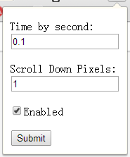

================================================================
chrome extension **Double Click then auto to Scroll Window down**
================================================================

## For the web reading model.

Usage
-----

::
	
	settings:
		
		scroll 1 Pixels donw every 0.1 second. (call the window.scroll funciont)
	
	Double click to call the `setInterval` function.